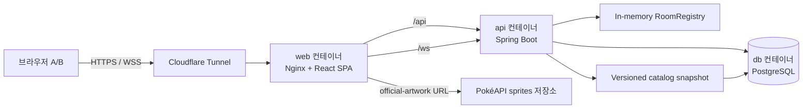
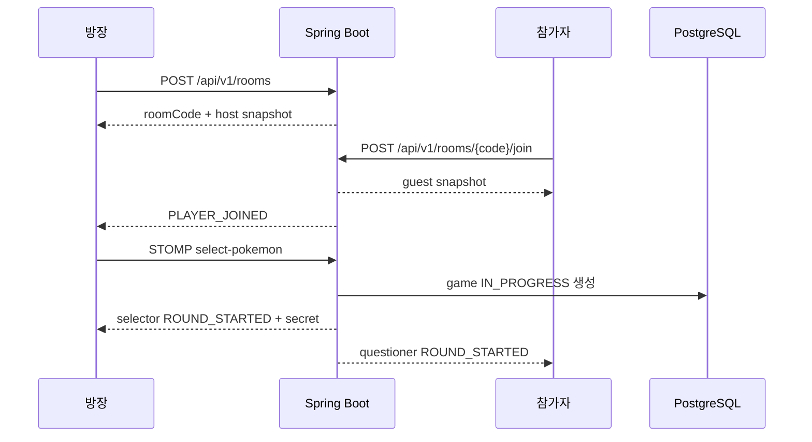

# Guess Pokémon 아키텍처

- 작성일: 2026-07-24
- 상태: 공식 설계 기준선

## 1. 설계 목표

- 두 명의 실시간 게임 상태를 서버가 단일 source of truth로 관리한다.
- 질문자에게 정답이 전달되지 않도록 공개 상태와 개인 상태를 분리한다.
- 회원·완료 경기·질문 기록은 PostgreSQL에 남기고, 활성 방·재접속 타이머는 단일 서버 메모리에 둔다.
- MacBook과 Mac mini에서 Docker Compose 하나로 같은 실행 단위를 재현한다.
- 첫 버전 범위를 넘는 분산 시스템과 인증 수단을 미리 구현하지 않되 교체 경계를 명확히 둔다.

## 2. 기술 기준

| 영역 | 선택 | 기준 |
|---|---|---|
| Web | React 19.2.x, TypeScript 7.0.x, Vite 8.1.x, Lucide React 1.26.x | SPA, 현재 안정 계열, SVG icon |
| Routing | React Router 8.3.x library mode | browser history, protected route, navigation blocker |
| 실시간 client | `@stomp/stompjs` 7.3.x | STOMP, reconnect, heartbeat |
| API | Spring Boot 4.1.0, Java 21, Gradle Wrapper 9.5.1 | Servlet 기반 단일 애플리케이션 |
| Security | Spring Security, Spring Session JDBC | same-origin cookie session, CSRF, PostgreSQL session |
| Persistence | Spring Data JPA, Flyway, PostgreSQL 18.4 | 계정·catalog·경기 기록 |
| Auth rate limit | Caffeine 3.2.x | 단일 instance의 짧은 수명 요청 제한 |
| 실시간 server | Spring WebSocket/STOMP simple broker | 단일 API instance |
| Reverse proxy | Nginx 1.30.4 Alpine multi-arch image | SPA fallback, `/api`, `/ws` proxy |
| 외부 공개 | Cloudflare Tunnel | 테스트 Quick Tunnel, 운영 named tunnel |
| 검증 | JUnit, Spring Test, Testcontainers, Vitest, Testing Library, Playwright | 계층별 자동 검증 |

구현 시작 시 patch 버전을 다시 확인하고 lockfile, Gradle Wrapper, Spring Boot dependency management에 고정한다.

## 3. 전체 구성



로컬 개발에서는 Cloudflare Tunnel 없이 `localhost`로 접근할 수 있다. 외부 통합 테스트 때만 Quick Tunnel profile을 켠다.

## 4. 저장소 구조

```text
guess-pokemon/
├── AGENTS.md
├── README.md
├── .dockerignore
├── .editorconfig
├── .env.example
├── .gitattributes
├── .gitignore
├── compose.yaml
├── compose.dev.yaml
├── compose.test.yaml
├── docs/
│   ├── PRD.md
│   ├── ARCHITECTURE.md
│   ├── ERD.md
│   ├── API.md
│   └── OPERATIONS.md
├── frontend/
│   ├── Dockerfile
│   ├── package.json
│   ├── package-lock.json
│   ├── vite.config.ts
│   └── src/
├── backend/
│   ├── Dockerfile
│   ├── build.gradle
│   ├── settings.gradle
│   ├── gradlew
│   ├── gradle/wrapper/
│   └── src/
├── infra/
│   ├── nginx/
│   └── cloudflared/
└── scripts/
    ├── fetch-pokemon-catalog.mjs
    ├── backup-db.sh
    └── verify-compose.sh
```

`docs/**`는 서비스 범위와 기술 명세를 관리하는 공식 프로젝트 문서다. 코드와 공개 계약을 변경할 때 관련 문서를 같은 변경 단위에서 갱신한다.

## 5. 백엔드 모듈 경계

단일 Spring Boot 애플리케이션 안에서 package boundary를 유지한다. 별도 Gradle multi-module이나 microservice는 도입하지 않는다.

```text
com.guesspokemon
├── auth
├── user
├── pokemon
├── room
├── game
├── history
├── realtime
├── security
└── common
```

### `auth`

- signup, login, logout, current user
- `AuthenticationManager`와 `SecurityContextRepository` 연계
- session fixation protection
- login ID별 실패와 client IP별 login·signup 요청 제한

### `user`

- `User` aggregate와 UUID
- login ID·nickname 정규화와 uniqueness
- password hash
- 이메일 인증은 후속 migration과 별도 credential 경계로 추가

### `pokemon`

- versioned catalog snapshot 검증
- `pokemon_species` 초기 적재
- 한국어 검색과 세대 filter
- official artwork kill switch

### `room`

- `ConcurrentHashMap` 기반 `RoomRegistry`
- 방 코드, 두 참가자, 현재 round, 연결 상태, 만료
- 사용자당 활성 방 하나
- room map과 사용자 index를 함께 바꾸는 create·join·leave·expire는 짧은 registry lock 안에서 처리
- 방별 직렬 실행 경계
- 방장만 남은 방은 최초 생성 30분 뒤 만료하고 1분 fixed-delay cleanup으로 제거
- 만료 code는 최대 10,000개를 30분 동안 tombstone으로 유지해 `410`과 `404`를 구분
- 활성 방 최대 1,000개, unique code 할당 최대 100회

### `game`

- framework와 분리한 순수 Java state machine
- `WAITING_FOR_SELECTION`, `PLAYING`, `PAUSED`, `RESULT` 전이
- 역할, 질문/추측 순서, 20회, 승패 계산
- 정답 포켓몬은 aggregate private field로 유지
- 기존 state를 직접 바꾸지 않고 immutable candidate를 만들어 persistence commit 뒤 교체

### `history`

- game, participant, action 영속화
- 현재 사용자 기준 목록 projection
- 참가자 인가 뒤 상세 조회

### `realtime`

- `WebSocketConfig`: `/ws`, `/app`, simple broker `/queue`, 10초 heartbeat
- `WebSocketSecurityConfig`: STOMP `CONNECT` CSRF·인증과 SEND·SUBSCRIBE allowlist
- `RealtimeCommandController`: select, ask, answer, guess, resume, rematch-ready
- `RealtimeEventPublisher`: `/user/queue/game-events` 역할별 event와 대기방 이탈 상태 동기화
- `RoomConnectionService`: session과 사용자·방 mapping, 마지막 session disconnect 판단, 60초 timeout
- `WebSocketDisconnectListener`: 중복 가능한 `SessionDisconnectEvent` 전달

## 6. 프런트엔드 경계

```text
src/
├── app/
│   └── routes.tsx
├── features/
│   ├── auth/
│   ├── room/        # 방 REST 계약, 대기방 화면, room state
│   ├── game/        # 후속 화면 단위
│   ├── pokemon/     # 후속 화면 단위
│   └── history/     # 후속 화면 단위
├── pages/
│   ├── HomePage.tsx
│   ├── LobbyPage.tsx
│   ├── NotFoundPage.tsx
│   ├── home.css
│   ├── lobby.css
│   └── system-status.css
├── shared/
│   ├── api/
│   ├── realtime/    # STOMP 연결, resume, 역할별 event parser
│   ├── ui/
│   └── validation/
├── styles/
│   ├── index.css
│   ├── tokens.css
│   ├── reset.css
│   ├── base.css
│   ├── shared-components.css
│   └── accessibility.css
└── test/
```

- route component는 orchestration만 맡고 기능 로직은 `features/**`에 둔다.
- `styles/index.css`는 전역 CSS 진입점이며 token, reset, base, 공통 component, 화면별 CSS, 접근성 규칙 순서로 불러온다.
- 전역 design token과 reset은 `styles/**`에 두고 auth·page selector와 반응형 규칙은 해당 feature·page 가까이에 둔다.
- 한국어 UI는 `word-break: keep-all`을 기본값으로 사용하고 code·room code 같은 기계 문자열만 별도 overflow 규칙을 적용한다.
- `AuthProvider`는 앱 시작 시 `/auth/me`로 session을 복원하고 `loading`, `anonymous`, `authenticated`, `error` 상태를 구분한다.
- `HttpClient`는 same-origin cookie credential, CSRF memory cache·1회 갱신, `ProblemDetail`, session 만료 알림을 공통 처리한다.
- anonymous-only route는 로그인 회원을 `/lobby`로 보내고, protected route는 원래 내부 URL을 보존한 채 비회원을 `/login`으로 보낸다.
- 로비는 방 생성·코드 입장·활성 방 이어하기를 REST API와 연결하고, `/rooms/:roomCode`는 direct URL과 뒤로가기를 지원한다.
- `@stomp/stompjs` client는 앱 전체에 하나만 활성화하고 room route 수명주기에 맞춰 `activate`·`deactivate`한다.
- room route는 연결할 때마다 CSRF credential을 넣고 사용자별 queue를 구독한 뒤 `resume`을 보내 authoritative snapshot을 복구한다.
- React StrictMode에서 중복 subscription이 남지 않도록 모든 subscription에 cleanup을 둔다.
- server snapshot을 기준으로 UI store를 재구성한다. 이전 version은 무시하고 같은 version의 `ROOM_SNAPSHOT`만 authoritative replacement로 허용한다.
- `ROOM_CLOSED`를 받으면 local active room을 비우고 닫힌 방 안내와 로비 복귀 경로를 제공한다.
- 정답 포켓몬 type을 selector 전용 snapshot에만 둔다.
- Lucide icon은 named import만 사용하고 장식 icon은 screen reader에서 숨긴다. icon-only control은 부모 control에 접근 가능한 이름을 제공한다.

## 7. 인증과 session 흐름

1. SPA 시작 시 `GET /api/v1/auth/me`로 기존 session을 복원한다.
2. 비회원 `401 AUTHENTICATION_REQUIRED`는 정상 anonymous 상태로 처리하고, network·server 오류는 로그인 여부를 추측하지 않고 재시도 화면을 제공한다.
3. state-changing REST 직전에 `GET /api/v1/auth/csrf`로 CSRF token을 준비하고 memory에만 cache한다.
4. signup 또는 login 요청에 CSRF header를 보내며 `CSRF_INVALID`이면 token을 갱신해 한 번만 재시도한다.
5. Spring Security가 인증 성공 뒤 session fixation 보호를 적용하고 frontend는 CSRF cache를 비운다.
6. Spring Session JDBC가 session과 SecurityContext를 PostgreSQL에 저장한다.
7. 브라우저는 `HttpOnly` session cookie를 같은 출처 REST와 WebSocket handshake에 자동 첨부한다.
8. login 성공 뒤 `/auth/me`를 다시 조회해 사용자와 `activeRoomCode`를 session snapshot으로 저장한다.
9. 공통 client가 `AUTHENTICATION_REQUIRED`를 받으면 auth state와 CSRF cache를 비우고 protected route를 `/login`으로 전환한다.
10. STOMP `CONNECT` frame에도 CSRF token을 넣는다.
11. backend는 HTTP request와 STOMP message의 `Principal`에서 사용자 UUID를 찾는다.
12. client payload의 user ID나 role은 신뢰하지 않는다.

운영 session cookie는 `Secure`, `HttpOnly`, `SameSite=Lax`다. 개발 환경의 HTTP cookie 차이는 profile로 제한하고 운영 설정을 약화하지 않는다.
session idle timeout은 30분이다.

## 8. 방 생성과 게임 시작



방 생성 직후에는 `WAITING_FOR_OPPONENT`, `stateVersion=1`, `roundNumber=1`이며 방장이 `SELECTOR`다. guest가 입장하면 `QUESTIONER`로 배정하고 `WAITING_FOR_SELECTION`, `stateVersion=2`로 전환한다. create·join 직후에는 참가자를 연결 상태로 시작하고 room route의 `resume` 또는 첫 성공 command가 STOMP session을 사용자·방에 연결한다. 이후 마지막으로 연결된 session이 끊기면 실제 socket 상태를 `connected=false`로 반영한다.

room code는 `I`, `O`, `0`, `1`을 제외한 6자리 대문자·숫자로 만든다. 입력은 앞뒤 공백 제거와 대문자 정규화 뒤 같은 alphabet으로 검증한다. code 충돌 재시도 상한이나 활성 방 상한을 넘으면 room map을 부분 갱신하지 않고 `ROOM_CAPACITY_UNAVAILABLE`을 반환한다.

대기 중 guest가 나가면 방장만 남은 상태로 되돌리고 guest active-room index를 해제한 뒤, 남은 방장에게 post-leave `ROOM_SNAPSHOT`을 보낸다. 대기 중 방장이 나가면 room과 두 participant index를 해제하고 나가지 않은 guest에게 `ROOM_CLOSED/HOST_LEFT`를 보낸다. 결과 단계 참가자가 room을 닫으면 상대에게 `ROOM_CLOSED/RESULT_ROOM_LEFT`를 보낸다. 진행 중 참가자가 나가면 `PLAYER_LEFT` 결과를 먼저 저장하고 두 참가자에게 `GAME_ENDED`를 보낸 뒤 room과 active game memory를 해제한다. 방장만 남은 room은 최초 생성 30분 뒤 만료한다. 두 명이 입장한 선택 대기 room의 별도 idle expiry는 첫 범위에 두지 않는다.

같은 event type이라도 selector와 questioner payload class를 분리한다. 공용 객체를 만들고 serializer annotation으로 필드를 감추는 방식은 사용하지 않는다.

## 9. 질문과 추측 처리

모든 command는 다음 순서로 처리한다.

1. 인증된 `Principal` 확인
2. room lock 안에서 room membership, role, status, expected version 확인
4. `commandId` 중복 확인
5. domain state transition
6. 필요한 DB 변경 transaction
7. transaction commit 뒤 game memory와 room 상태 교체
8. room lock 해제 뒤 participant별 event 생성·전송

질문은 pending 상태를 만든다. 답변을 저장한 뒤 다음 행동을 허용한다. 추측은 서버가 `pokemon_species_id`를 정답과 비교해 즉시 결과를 확정한다.

game start는 game 1건과 participant 2건을 한 transaction에 저장한다. 질문·답변·추측도 action과 game count·version·필요한 participant result를 같은 transaction에 반영한다. command service는 persistence bean의 transaction이 commit된 뒤에만 immutable candidate를 registry current state로 교체한다. DB 실패 시 이전 memory aggregate를 그대로 유지한다.

active game은 모든 processed command ID를 memory에 보관한다. 질문·추측 command ID는 `game_action` unique constraint로도 막는다. 답변은 기존 action row를 갱신하므로 command ID를 memory에서 관리한다. 서버 재시작 뒤 active game을 복구하지 않는 동안은 별도 command journal을 두지 않는다.

game command 시각은 PostgreSQL `timestamptz` 정밀도에 맞춰 microsecond로 절삭한 뒤 domain과 DB에 함께 전달한다. 따라서 transaction 이후 DB에서 game을 다시 읽어도 immutable memory aggregate의 identity timestamp와 동일하게 비교할 수 있다.

room과 game은 client에 하나의 `stateVersion` 흐름으로 보인다. disconnect·resume처럼 DB game row를 바꾸지 않는 room 전이도 version을 증가시킬 수 있다. 다음 game command는 DB optimistic check에 직전 game version을 사용하고 candidate는 room의 다음 version으로 맞춘다. 따라서 version 사이에 연결 event가 들어와도 stale command를 거부하면서 DB와 room의 최신 version이 다시 합쳐진다.

action이 없는 `PLAYER_LEFT`, `RECONNECT_TIMEOUT`, `BOTH_DISCONNECTED` 종료는 `GamePersistencePort.updateGame`으로 game과 participant result를 한 transaction에서 반영한다. `COMPLETED`는 한 명의 승자·패자를, `ABORTED/BOTH_DISCONNECTED`는 두 명의 `NONE` 결과를 저장한다.

## 10. 재접속

1. `resume` 또는 첫 성공 room command가 STOMP session ID를 인증 사용자와 활성 방에 연결한다.
2. `SessionDisconnectEvent`를 받으면 mapping을 한 번만 제거한다.
3. 같은 사용자·방에 다른 session이 남아 있으면 연결 상태를 유지한다.
4. 마지막 session이고 명시적 leave가 아니면 사용자를 offline으로 표시하고 진행 중 경기에는 `reconnectDeadline = now + 60s`와 새 token을 설정한다.
5. 두 참가자에게 `PLAYER_CONNECTION_CHANGED`를 보내고 scheduler에 timeout task를 등록한다.
6. 같은 인증 사용자가 `/rooms/:roomCode`로 돌아와 `resume` command를 보내면 기존 task를 취소한다.
7. 역할별 snapshot과 누락 event 이후 상태를 다시 보낸다.
8. task는 현재 token·deadline·room status가 모두 같을 때만 실행한다.
9. 한 명만 offline이면 `RECONNECT_TIMEOUT`, 두 명 모두 offline이면 먼저 도래한 deadline에 `BOTH_DISCONNECTED`를 확정한다.

STOMP library의 자동 재연결만 신뢰하지 않는다. 브라우저 route가 복원되지 않거나 새 socket session이 생길 수 있으므로 명시적 `resume` command와 server snapshot을 사용한다.

heartbeat, reconnect timeout, 기존 `@Scheduled` room cleanup은 이름이 `taskScheduler`인 2-thread scheduler bean을 사용한다. 취소한 task는 queue에서 제거하고, resume와 timeout은 같은 connection lock에서 경쟁해 한쪽 결과만 적용한다.

## 11. 영속 상태와 메모리 상태

| 상태 | 위치 | 이유 |
|---|---|---|
| 사용자·비밀번호 hash | PostgreSQL | 영구 계정 |
| HTTP session | PostgreSQL | API 재시작 뒤 로그인 유지 |
| 포켓몬 catalog | PostgreSQL + versioned snapshot | 검색 성능·재현성 |
| 경기·참가자·행동 | PostgreSQL | 기록과 무결성 |
| 방 코드·대기 상태 | API memory | 짧은 수명, 단일 instance |
| 현재 game aggregate | API memory + 핵심 전이 DB 반영 | 낮은 지연과 기록 보존 |
| socket mapping·60초 task | API memory | 연결 수명과 결합 |
| 인증 요청 제한 | API Caffeine memory | 10분 수명, 최대 key 수 제한 |

API 시작 시 DB의 `IN_PROGRESS` game을 한 transaction에서 `ABORTED/SERVER_RESTART`로 정리하고 state version과 종료 시각을 갱신한다. 진행 중 방 자체는 복구하지 않는다.

## 12. 포켓몬 catalog

- `scripts/fetch-pokemon-catalog.mjs`는 명시적으로 실행하는 개발 도구다.
- PokéAPI에서 기본 species, 한국어 이름, generation, official artwork URL을 모은다.
- PokéAPI Fair Use Policy에 맞춰 응답을 `scripts/.cache/pokeapi/`에 저장하고 cache miss만 제한된 동시성으로 요청한다.
- PokéAPI species count가 승인된 최대 번호 1,025와 다르면 새 종을 자동 포함하지 않고 생성에 실패한다.
- 1부터 snapshot의 최대 National Dex 번호까지 다음 조건을 검증한다.
  - ID 중복·누락 없음
  - slug·한국어 이름 존재와 중복 없음
  - generation 1~9
  - default variety 정확히 하나
  - HTTPS official artwork URL 존재
- 결과를 `backend/src/main/resources/catalog/pokemon-species.json`에 저장한다.
- canonical species content의 SHA-256 일부를 catalog version으로 사용하고 생성 시각은 별도 field로 기록한다.
- 애플리케이션은 snapshot을 다시 검증한 뒤 같은 catalog version 1,025행이 없을 때 transaction으로 JDBC batch upsert한다.
- 같은 National Dex ID의 기존 `enabled=false`는 import가 되살리지 않는다. 현재 snapshot에 없는 과거 version row는 기록 FK 보존을 위해 삭제하지 않고 비활성화한다.
- 운영 시작마다 PokéAPI를 호출하거나 자동으로 종 수를 바꾸지 않는다.
- catalog 갱신은 독립 commit과 검증 결과를 요구한다.

## 13. Docker와 배포

### 개발

- `compose.dev.yaml`은 source bind mount와 Vite dev server, Spring `bootRun`, PostgreSQL을 구성한다.
- host에는 Docker 외 Java·Node·PostgreSQL을 요구하지 않는다.
- Vite는 `/api`, `/ws`를 API container로 proxy한다.
- base Compose와 개발 override를 함께 사용하며 Vite는 host의 `5173` port에, Adminer는 loopback의 `${ADMINER_PORT:-8081}` port에 공개한다.
- Adminer는 Docker network의 `db:5432`에 연결하고 PostgreSQL port 자체는 host에 공개하지 않는다.
- Adminer service는 `compose.dev.yaml`에만 정의하며 기본·테스트·운영 구성에는 포함하지 않는다.
- MacBook 개발 DB는 개발 전용 DB 이름·계정과 named volume을 사용하고 Docker 재시작 뒤에도 데이터를 유지한다.

### 테스트

- `compose.test.yaml`은 frontend 검증, backend Testcontainers 통합 테스트, Nginx 설정 회귀 테스트를 분리한다.
- backend test는 `postgres:18.4-alpine3.24`, `@ServiceConnection`을 사용해 실행마다 격리된 DB를 만든다.
- Docker Desktop의 sibling container 통신을 위해 source를 host와 같은 절대경로에 mount하고 `TESTCONTAINERS_HOST_OVERRIDE=host.docker.internal`을 사용한다.
- backend test container의 `/var/run/docker.sock` mount는 Docker daemon 전체 제어 권한에 해당하므로 신뢰할 수 있는 로컬 코드 검증에만 사용한다.
- 외부 PokéAPI에 의존하지 않고 versioned catalog fixture를 사용한다.
- Testcontainers DB는 실행마다 임의 port와 credential을 사용하고 test 종료 뒤 폐기한다.

### 운영

- 현재 production-like 구성은 `web`, `api`, `db` 세 service를 사용하고, `tunnel`은 홈서버 배포 단계에서 추가한다.
- `db`는 external port를 publish하지 않고 Docker network에만 expose한다.
- named volume을 PostgreSQL 18의 `/var/lib/postgresql`에 mount해 data를 보관한다.
- `web`만 내부 HTTP origin으로 노출하고 Tunnel이 outbound connection을 만든다.
- Nginx는 `/api`, `/ws`, SPA fallback, request body limit, security header를 담당한다.
- Nginx는 외부에서 받은 `X-Forwarded-For`를 이어 붙이지 않고 직접 확인한 remote address로 덮어쓴다.
- `/ws` proxy는 원래 `Host`의 명시적 port를 `X-Forwarded-Port`로 전달한다. Docker port mapping에서도 Spring same-origin 검사가 브라우저 `Origin`과 같은 외부 port를 비교하게 한다.
- Nginx가 외부에 전달하는 Actuator 경로는 liveness와 readiness 두 개로 제한한다.
- API readiness에는 `readinessState`와 `db`를 포함하고 liveness에는 외부 dependency를 포함하지 않는다.
- Cloudflare가 외부 TLS를 종료하고 `X-Forwarded-*`를 전달한다.
- Spring은 신뢰하는 proxy header만 처리하도록 설정한다.
- Mac mini 운영 DB는 MacBook 개발 DB와 다른 DB 이름·계정·secret·named volume을 사용한다.
- 운영 migration은 Testcontainers 검증을 통과한 동일한 Flyway 파일을 backup 뒤 적용한다.

Testcontainers, MacBook 개발, Mac mini 운영 환경은 DB와 volume을 공유하지 않는다. schema source는 하나의 Flyway migration 집합으로 유지한다.

## 14. 보안 경계

- secret, password, token, 실제 DB URL을 Git에 넣지 않는다.
- `.env.example`은 key 이름과 안전한 placeholder만 제공한다.
- 운영 secret file과 backup directory는 `.gitignore`에 포함한다.
- application은 login ID별 실패 5회/10분, client IP별 login 30회/10분, signup 5회/10분을 제한한다.
- 제한 상태는 Caffeine cache 세 개에 각각 최대 10,000개 key만 저장한다. API 재시작 시 초기화되며 여러 API instance가 상태를 공유하지 않는다.
- Nginx 자체 rate limit과 Cloudflare client IP 신뢰 설정은 홈서버 배포 단위에서 추가한다.
- STOMP `CONNECT`는 HTTP session 인증과 CSRF token을 검사한다.
- STOMP `SEND`는 `/app/rooms/**`만 허용하고 handler가 room membership을 검사한다.
- STOMP `SUBSCRIBE`는 사용자별 `/user/queue/game-events`, `/user/queue/errors`만 허용한다. 공개 room subscription은 없다.
- 모든 outbound event를 `/user/queue/game-events`로 보내고 공개 room topic은 만들지 않는다.
- error 응답은 안정적인 code만 제공하고 내부 예외와 stack trace를 감춘다.
- log에는 login ID 원문 대신 user UUID를 우선 사용하고 question text와 session ID를 남기지 않는다.
- CSP `img-src`는 self, data placeholder, 공식 artwork host만 허용한다.
- `POKEMON_ARTWORK_ENABLED=false` 경로를 자동 테스트한다.

## 15. 관측과 운영

- Actuator health는 container healthcheck용 최소 정보만 제공한다.
- 애플리케이션 log는 JSON 강제 없이 구조화 가능한 key-value 형식을 사용한다.
- 주요 audit event:
  - signup 성공·실패 분류
  - login 실패 횟수
  - room create/join/expire
  - game start/end와 end reason
  - reconnect start/success/timeout
- password, CSRF token, session ID, question 본문, 실제 정답은 debug log에도 남기지 않는다.
- `docs/OPERATIONS.md`에 start, stop, update, backup, restore rehearsal, tunnel 전환, rollback을 적는다.

## 16. 확장 경계

### 이메일 인증

- `User.id`는 그대로 유지한다.
- 후속 migration에서 email credential과 verification token을 추가한다.
- 기존 login ID credential과 병행한 뒤 정책 결정에 따라 전환한다.
- 현재 schema에 사용하지 않는 nullable email 컬럼을 미리 넣지 않는다.

### 다중 서버

- 지금은 single instance invariant를 문서화한다.
- 필요할 때 `RoomStore`, scheduler, broker 경계를 Redis·외부 broker로 교체한다.
- 실제 부하 근거가 생기기 전에는 해당 abstraction과 dependency를 만들지 않는다.

## 17. 주요 트레이드오프

| 결정 | 장점 | 비용 |
|---|---|---|
| Spring Boot + STOMP | 인증·DB·WebSocket 통합 | Node보다 초기 코드량 증가 |
| 사용자별 event queue | 정답 노출·무단 구독 위험 감소 | 같은 공개 event를 두 번 생성 |
| DB session | API 재시작 뒤 로그인 유지 | session table·cleanup 필요 |
| memory auth limiter | Redis 없이 단일 서버에서 단순하게 제한 | 재시작·다중 instance에서 상태 초기화·분리 |
| memory room | 구현·지연 최소화 | API 재시작·다중 instance 복구 불가 |
| versioned catalog | 재현 가능·외부 API 장애 격리 | 새 포켓몬 반영에 명시적 갱신 필요 |
| Cloudflare Tunnel | 포트 개방·공인 IP 불필요 | 외부 공급자와 계정에 의존 |

## 18. 아키텍처 완료 조건

- 정답이 질문자 DTO에 컴파일 단계부터 존재하지 않는다.
- game state machine이 Spring·JPA 없이 단위 테스트 가능하다.
- REST·STOMP command 모두 같은 application service와 domain 규칙을 호출한다.
- DB migration, session schema, catalog seed가 빈 PostgreSQL에서 재현된다.
- Docker Compose로 local, test, production-like profile을 구분한다.
- 향후 이메일 인증과 다중 서버는 현재 dead code 없이 확장 지점만 문서로 남긴다.
