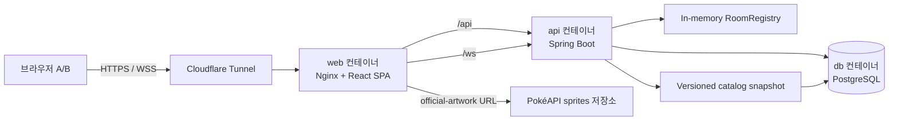
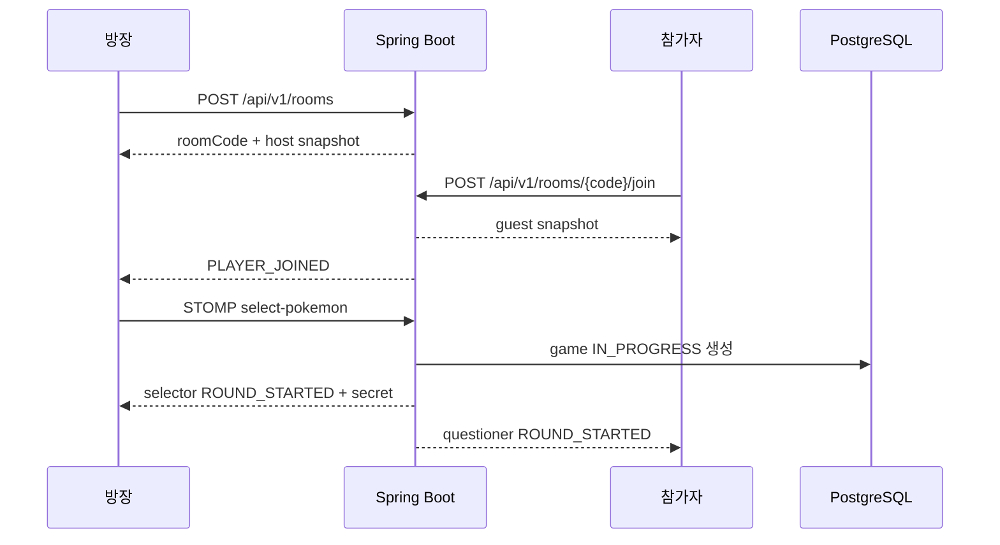

# Guess Pokémon 아키텍처

- 작성일: 2026-07-24
- 상태: 공식 설계 기준선

## 1. 설계 목표

- 두 명의 실시간 게임 상태를 서버가 단일 source of truth로 관리한다.
- 질문자에게 정답이 전달되지 않도록 공개 상태와 개인 상태를 분리한다.
- 회원·완료 경기·질문 기록은 PostgreSQL에 남기고, 활성 방·재접속 타이머는 단일 서버 메모리에 둔다.
- MacBook과 Mac mini에서 Docker Compose 하나로 같은 실행 단위를 재현한다.
- 첫 버전 범위를 넘는 분산 시스템과 인증 수단을 미리 구현하지 않되 교체 경계를 명확히 둔다.

## 2. 기술 기준

| 영역 | 선택 | 기준 |
|---|---|---|
| Web | React 19.2.x, TypeScript 7.0.x, Vite 8.1.x, Lucide React 1.26.x | SPA, 현재 안정 계열, SVG icon |
| Routing | React Router 8.3.x library mode | browser history, protected route, navigation blocker |
| 실시간 client | `@stomp/stompjs` 7.3.x | STOMP, reconnect, heartbeat |
| API | Spring Boot 4.1.0, Java 21, Gradle Wrapper 9.5.1 | Servlet 기반 단일 애플리케이션 |
| Security | Spring Security, Spring Session JDBC | same-origin cookie session, CSRF, PostgreSQL session |
| Persistence | Spring Data JPA, Flyway, PostgreSQL 18.4 | 계정·catalog·경기 기록 |
| 실시간 server | Spring WebSocket/STOMP simple broker | 단일 API instance |
| Reverse proxy | Nginx 1.30.4 Alpine multi-arch image | SPA fallback, `/api`, `/ws` proxy |
| 외부 공개 | Cloudflare Tunnel | 테스트 Quick Tunnel, 운영 named tunnel |
| 검증 | JUnit, Spring Test, Testcontainers, Vitest, Testing Library, Playwright | 계층별 자동 검증 |

구현 시작 시 patch 버전을 다시 확인하고 lockfile, Gradle Wrapper, Spring Boot dependency management에 고정한다.

## 3. 전체 구성



로컬 개발에서는 Cloudflare Tunnel 없이 `localhost`로 접근할 수 있다. 외부 통합 테스트 때만 Quick Tunnel profile을 켠다.

## 4. 저장소 구조

```text
guess-pokemon/
├── AGENTS.md
├── README.md
├── .dockerignore
├── .editorconfig
├── .env.example
├── .gitattributes
├── .gitignore
├── compose.yaml
├── compose.dev.yaml
├── compose.test.yaml
├── docs/
│   ├── PRD.md
│   ├── ARCHITECTURE.md
│   ├── ERD.md
│   ├── API.md
│   └── OPERATIONS.md
├── frontend/
│   ├── Dockerfile
│   ├── package.json
│   ├── package-lock.json
│   ├── vite.config.ts
│   └── src/
├── backend/
│   ├── Dockerfile
│   ├── build.gradle
│   ├── settings.gradle
│   ├── gradlew
│   ├── gradle/wrapper/
│   └── src/
├── infra/
│   ├── nginx/
│   └── cloudflared/
└── scripts/
    ├── fetch-pokemon-catalog.mjs
    ├── backup-db.sh
    └── verify-compose.sh
```

`docs/**`는 서비스 범위와 기술 명세를 관리하는 공식 프로젝트 문서다. 코드와 공개 계약을 변경할 때 관련 문서를 같은 변경 단위에서 갱신한다.

## 5. 백엔드 모듈 경계

단일 Spring Boot 애플리케이션 안에서 package boundary를 유지한다. 별도 Gradle multi-module이나 microservice는 도입하지 않는다.

```text
com.guesspokemon
├── auth
├── user
├── pokemon
├── room
├── game
├── history
├── realtime
├── security
└── common
```

### `auth`

- signup, login, logout, current user
- `AuthenticationManager`와 `SecurityContextRepository` 연계
- session fixation protection

### `user`

- `User` aggregate와 UUID
- login ID·nickname 정규화와 uniqueness
- password hash
- 이메일 인증은 후속 migration과 별도 credential 경계로 추가

### `pokemon`

- versioned catalog snapshot 검증
- `pokemon_species` 초기 적재
- 한국어 검색과 세대 filter
- official artwork kill switch

### `room`

- `ConcurrentHashMap` 기반 `RoomRegistry`
- 방 코드, 두 참가자, 현재 round, 연결 상태, 만료
- 사용자당 활성 방 하나
- 방별 직렬 실행 경계

### `game`

- framework와 분리한 순수 Java state machine
- `WAITING_FOR_SELECTION`, `PLAYING`, `PAUSED`, `RESULT` 전이
- 역할, 질문/추측 순서, 20회, 승패 계산
- 정답 포켓몬은 aggregate private field로 유지

### `history`

- game, participant, action 영속화
- 현재 사용자 기준 목록 projection
- 참가자 인가 뒤 상세 조회

### `realtime`

- STOMP command controller
- user-specific event publisher
- connect/disconnect event listener
- 60초 timeout scheduler
- command idempotency와 state version

## 6. 프런트엔드 경계

```text
src/
├── app/
│   ├── router/
│   └── providers/
├── features/
│   ├── auth/
│   ├── lobby/
│   ├── room/
│   ├── game/
│   ├── pokemon/
│   └── history/
├── shared/
│   ├── api/
│   ├── realtime/
│   ├── ui/
│   ├── validation/
│   └── types/
└── test/
```

- route component는 orchestration만 맡고 기능 로직은 `features/**`에 둔다.
- REST client는 cookie credential과 CSRF header를 공통 처리한다.
- STOMP client는 앱 전체에 하나만 활성화하고 로그인·로그아웃 수명주기에 맞춰 `activate`·`deactivate`한다.
- React StrictMode에서 중복 subscription이 남지 않도록 모든 subscription에 cleanup을 둔다.
- server snapshot을 기준으로 UI store를 재구성하고 event `stateVersion`이 이전 값이면 무시한다.
- 정답 포켓몬 type을 selector 전용 snapshot에만 둔다.
- Lucide icon은 named import만 사용하고 장식 icon은 screen reader에서 숨긴다. icon-only control은 부모 control에 접근 가능한 이름을 제공한다.

## 7. 인증과 session 흐름

1. SPA가 `GET /api/v1/auth/csrf`로 CSRF token을 준비한다.
2. signup 또는 login 요청에 CSRF header를 보낸다.
3. Spring Security가 인증 성공 뒤 session fixation 보호를 적용한다.
4. Spring Session JDBC가 session과 SecurityContext를 PostgreSQL에 저장한다.
5. 브라우저는 `HttpOnly` session cookie를 같은 출처 REST와 WebSocket handshake에 자동 첨부한다.
6. STOMP `CONNECT` frame에도 CSRF token을 넣는다.
7. backend는 HTTP request와 STOMP message의 `Principal`에서 사용자 UUID를 찾는다.
8. client payload의 user ID나 role은 신뢰하지 않는다.

운영 session cookie는 `Secure`, `HttpOnly`, `SameSite=Lax`다. 개발 환경의 HTTP cookie 차이는 profile로 제한하고 운영 설정을 약화하지 않는다.

## 8. 방 생성과 게임 시작



같은 event type이라도 selector와 questioner payload class를 분리한다. 공용 객체를 만들고 serializer annotation으로 필드를 감추는 방식은 사용하지 않는다.

## 9. 질문과 추측 처리

모든 command는 다음 순서로 처리한다.

1. 인증된 `Principal` 확인
2. room membership 확인
3. room lock 안에서 role, status, expected version 확인
4. `commandId` 중복 확인
5. domain state transition
6. 필요한 DB 변경 transaction
7. transaction commit 뒤 participant별 event 생성·전송

질문은 pending 상태를 만든다. 답변을 저장한 뒤 다음 행동을 허용한다. 추측은 서버가 `pokemon_species_id`를 정답과 비교해 즉시 결과를 확정한다.

## 10. 재접속

1. `SessionDisconnectEvent`를 받으면 해당 STOMP session과 사용자·방 mapping을 찾는다.
2. 명시적 leave가 아니면 사용자를 offline으로 표시하고 `reconnectDeadline = now + 60s`를 설정한다.
3. 상대에게 `PLAYER_CONNECTION_CHANGED`를 보낸다.
4. scheduler에 timeout task를 등록한다.
5. 같은 인증 사용자가 `/rooms/:roomCode`로 돌아와 `resume` command를 보내면 기존 task를 취소한다.
6. 역할별 snapshot과 누락 event 이후 상태를 다시 보낸다.
7. deadline이 지나면 domain command로 이탈 패배를 확정하고 DB와 두 참가자 event를 갱신한다.

STOMP library의 자동 재연결만 신뢰하지 않는다. 브라우저 route가 복원되지 않거나 새 socket session이 생길 수 있으므로 명시적 `resume` command와 server snapshot을 사용한다.

## 11. 영속 상태와 메모리 상태

| 상태 | 위치 | 이유 |
|---|---|---|
| 사용자·비밀번호 hash | PostgreSQL | 영구 계정 |
| HTTP session | PostgreSQL | API 재시작 뒤 로그인 유지 |
| 포켓몬 catalog | PostgreSQL + versioned snapshot | 검색 성능·재현성 |
| 경기·참가자·행동 | PostgreSQL | 기록과 무결성 |
| 방 코드·대기 상태 | API memory | 짧은 수명, 단일 instance |
| 현재 game aggregate | API memory + 핵심 전이 DB 반영 | 낮은 지연과 기록 보존 |
| socket mapping·60초 task | API memory | 연결 수명과 결합 |

API 시작 시 DB의 오래된 `IN_PROGRESS` game을 `ABORTED/SERVER_RESTART`로 정리한다. 진행 중 방 자체는 복구하지 않는다.

## 12. 포켓몬 catalog

- `scripts/fetch-pokemon-catalog.mjs`는 명시적으로 실행하는 개발 도구다.
- PokéAPI에서 기본 species, 한국어 이름, generation, official artwork URL을 모은다.
- 1부터 snapshot의 최대 National Dex 번호까지 다음 조건을 검증한다.
  - ID 중복·누락 없음
  - 한국어 이름 존재
  - default variety 존재
  - official artwork URL 존재
- 결과를 `backend/src/main/resources/catalog/pokemon-species.json`에 저장한다.
- 애플리케이션은 catalog version이 DB에 없을 때 transaction으로 upsert한다.
- 운영 시작마다 PokéAPI를 호출하거나 자동으로 종 수를 바꾸지 않는다.
- catalog 갱신은 독립 commit과 검증 결과를 요구한다.

## 13. Docker와 배포

### 개발

- `compose.dev.yaml`은 source bind mount와 Vite dev server, Spring `bootRun`, PostgreSQL을 구성한다.
- host에는 Docker 외 Java·Node·PostgreSQL을 요구하지 않는다.
- Vite는 `/api`, `/ws`를 API container로 proxy한다.
- base Compose와 개발 override를 함께 사용하며 Vite만 host의 `5173` port에 공개한다.

### 테스트

- `compose.test.yaml`은 frontend 검증과 backend Testcontainers 통합 테스트를 분리한다.
- backend test는 `postgres:18.4-alpine3.24`, `@ServiceConnection`을 사용해 실행마다 격리된 DB를 만든다.
- Docker Desktop의 sibling container 통신을 위해 source를 host와 같은 절대경로에 mount하고 `TESTCONTAINERS_HOST_OVERRIDE=host.docker.internal`을 사용한다.
- backend test container의 `/var/run/docker.sock` mount는 Docker daemon 전체 제어 권한에 해당하므로 신뢰할 수 있는 로컬 코드 검증에만 사용한다.
- 외부 PokéAPI에 의존하지 않고 versioned catalog fixture를 사용한다.

### 운영

- 현재 production-like 구성은 `web`, `api`, `db` 세 service를 사용하고, `tunnel`은 홈서버 배포 단계에서 추가한다.
- `db`는 external port를 publish하지 않고 Docker network에만 expose한다.
- named volume을 PostgreSQL 18의 `/var/lib/postgresql`에 mount해 data를 보관한다.
- `web`만 내부 HTTP origin으로 노출하고 Tunnel이 outbound connection을 만든다.
- Nginx는 `/api`, `/ws`, SPA fallback, request body limit, security header를 담당한다.
- Nginx가 외부에 전달하는 Actuator 경로는 liveness와 readiness 두 개로 제한한다.
- API readiness에는 `readinessState`와 `db`를 포함하고 liveness에는 외부 dependency를 포함하지 않는다.
- Cloudflare가 외부 TLS를 종료하고 `X-Forwarded-*`를 전달한다.
- Spring은 신뢰하는 proxy header만 처리하도록 설정한다.

## 14. 보안 경계

- secret, password, token, 실제 DB URL을 Git에 넣지 않는다.
- `.env.example`은 key 이름과 안전한 placeholder만 제공한다.
- 운영 secret file과 backup directory는 `.gitignore`에 포함한다.
- Nginx와 application 양쪽에서 auth endpoint rate limit을 둔다.
- STOMP `SUBSCRIBE`, `SEND`는 인증과 room membership을 검사한다.
- 모든 outbound event를 `/user/queue/game-events`로 보내고 공개 room topic은 만들지 않는다.
- error 응답은 안정적인 code만 제공하고 내부 예외와 stack trace를 감춘다.
- log에는 login ID 원문 대신 user UUID를 우선 사용하고 question text와 session ID를 남기지 않는다.
- CSP `img-src`는 self, data placeholder, 공식 artwork host만 허용한다.
- `POKEMON_ARTWORK_ENABLED=false` 경로를 자동 테스트한다.

## 15. 관측과 운영

- Actuator health는 container healthcheck용 최소 정보만 제공한다.
- 애플리케이션 log는 JSON 강제 없이 구조화 가능한 key-value 형식을 사용한다.
- 주요 audit event:
  - signup 성공·실패 분류
  - login 실패 횟수
  - room create/join/expire
  - game start/end와 end reason
  - reconnect start/success/timeout
- password, CSRF token, session ID, question 본문, 실제 정답은 debug log에도 남기지 않는다.
- `docs/OPERATIONS.md`에 start, stop, update, backup, restore rehearsal, tunnel 전환, rollback을 적는다.

## 16. 확장 경계

### 이메일 인증

- `User.id`는 그대로 유지한다.
- 후속 migration에서 email credential과 verification token을 추가한다.
- 기존 login ID credential과 병행한 뒤 정책 결정에 따라 전환한다.
- 현재 schema에 사용하지 않는 nullable email 컬럼을 미리 넣지 않는다.

### 다중 서버

- 지금은 single instance invariant를 문서화한다.
- 필요할 때 `RoomStore`, scheduler, broker 경계를 Redis·외부 broker로 교체한다.
- 실제 부하 근거가 생기기 전에는 해당 abstraction과 dependency를 만들지 않는다.

## 17. 주요 트레이드오프

| 결정 | 장점 | 비용 |
|---|---|---|
| Spring Boot + STOMP | 인증·DB·WebSocket 통합 | Node보다 초기 코드량 증가 |
| 사용자별 event queue | 정답 노출·무단 구독 위험 감소 | 같은 공개 event를 두 번 생성 |
| DB session | API 재시작 뒤 로그인 유지 | session table·cleanup 필요 |
| memory room | 구현·지연 최소화 | API 재시작·다중 instance 복구 불가 |
| versioned catalog | 재현 가능·외부 API 장애 격리 | 새 포켓몬 반영에 명시적 갱신 필요 |
| Cloudflare Tunnel | 포트 개방·공인 IP 불필요 | 외부 공급자와 계정에 의존 |

## 18. 아키텍처 완료 조건

- 정답이 질문자 DTO에 컴파일 단계부터 존재하지 않는다.
- game state machine이 Spring·JPA 없이 단위 테스트 가능하다.
- REST·STOMP command 모두 같은 application service와 domain 규칙을 호출한다.
- DB migration, session schema, catalog seed가 빈 PostgreSQL에서 재현된다.
- Docker Compose로 local, test, production-like profile을 구분한다.
- 향후 이메일 인증과 다중 서버는 현재 dead code 없이 확장 지점만 문서로 남긴다.
