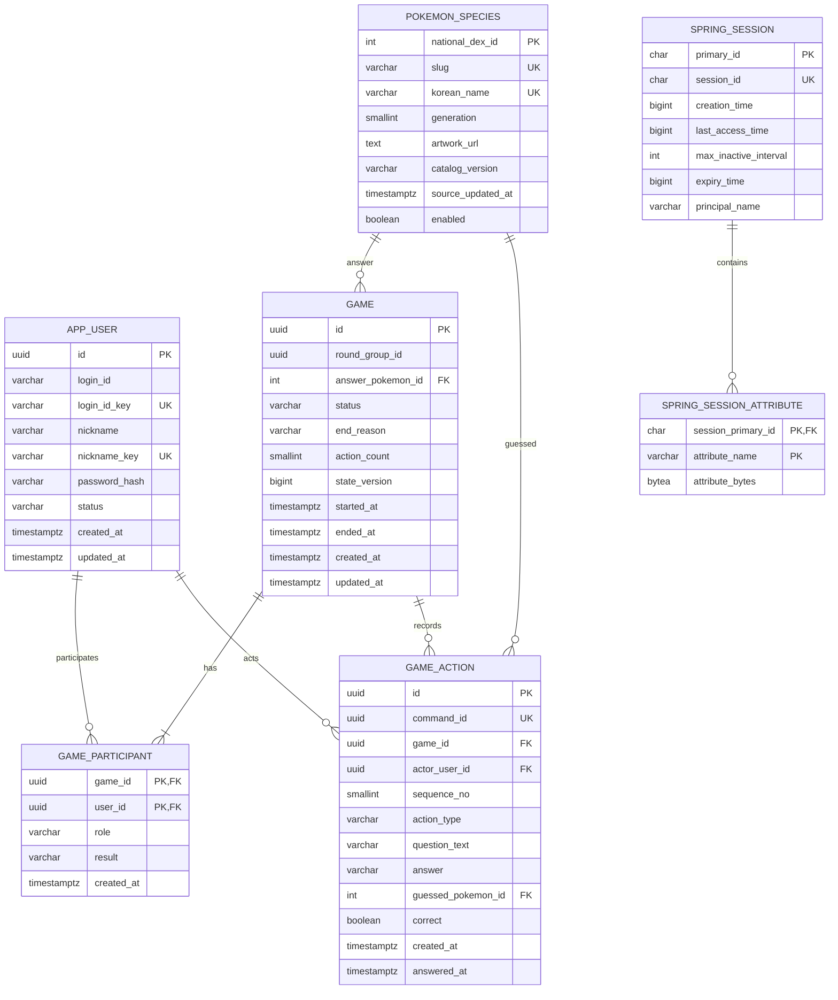

# Guess Pokémon ERD

- 작성일: 2026-07-24
- DB: PostgreSQL 18.x
- migration: Flyway
- 상태: 공식 논리 설계 기준선

## 1. 설계 원칙

- 모든 영구 시간은 UTC `timestamptz`로 저장한다.
- 애플리케이션 entity ID는 UUID를 사용한다.
- National Dex 번호는 포켓몬의 안정 식별자로 사용한다.
- 방은 짧은 수명의 메모리 상태이므로 DB table을 만들지 않는다.
- 완료·중단 경기와 행동은 DB에 남긴다.
- enum은 PostgreSQL enum 대신 `varchar + CHECK`를 사용해 migration 부담을 낮춘다.
- login ID와 nickname은 표시값과 normalized key를 분리해 case-insensitive uniqueness를 보장한다.

## 2. 관계도

`SPRING_SESSION*`은 infrastructure table이며 `APP_USER`와 DB FK를 만들지 않는다. session의 principal name은 Spring Security가 관리한다.

## 3. `app_user`

| Column | Type | Null | Constraint | 설명 |
|---|---|---:|---|---|
| `id` | `uuid` | N | PK | 외부 인증 수단과 분리한 사용자 ID |
| `login_id` | `varchar(30)` | N |  | 사용자 입력 표시값 |
| `login_id_key` | `varchar(30)` | N | UK | trim·lowercase 정규화 값 |
| `nickname` | `varchar(16)` | N |  | 게임 표시 이름 |
| `nickname_key` | `varchar(32)` | N | UK | Unicode normalize·lowercase 값 |
| `password_hash` | `varchar(255)` | N |  | `{bcrypt}...` 등 algorithm prefix 포함 |
| `status` | `varchar(20)` | N | CHECK | `ACTIVE`, `DISABLED` |
| `created_at` | `timestamptz` | N |  | 생성 시각 |
| `updated_at` | `timestamptz` | N |  | 최종 변경 시각 |

추가 제약:

- `login_id_key`는 `^[a-z0-9_]{4,30}$`
- nickname은 application validation에서 2~16자와 금지 제어문자를 검사한다.
- password 원문은 DB column과 entity에 두지 않는다.
- 이메일 인증을 추가할 때 `user_email` 또는 credential table을 별도 migration으로 추가한다.

## 4. `pokemon_species`

| Column | Type | Null | Constraint | 설명 |
|---|---|---:|---|---|
| `national_dex_id` | `integer` | N | PK, CHECK > 0 | 전국도감 번호 |
| `slug` | `varchar(80)` | N | UK | PokéAPI 영문 resource name |
| `korean_name` | `varchar(80)` | N | UK | 공식 한국어 이름 |
| `generation` | `smallint` | N | CHECK 1~99 | 첫 등장 세대 |
| `artwork_url` | `text` | N | HTTPS validation | 기본 official artwork URL |
| `catalog_version` | `varchar(40)` | N |  | snapshot 식별자 |
| `source_updated_at` | `timestamptz` | N |  | snapshot 생성 시각 |
| `enabled` | `boolean` | N | default true | kill switch·누락 대응 |

catalog snapshot은 1~1,025 ID 연속성, 한국어 이름, artwork URL을 import 전에 검증한다.

## 5. `game`

| Column | Type | Null | Constraint | 설명 |
|---|---|---:|---|---|
| `id` | `uuid` | N | PK | 경기 ID |
| `round_group_id` | `uuid` | N | INDEX | 같은 방의 재대결 묶음, 방 자체는 저장하지 않음 |
| `answer_pokemon_id` | `integer` | N | FK | 정답 포켓몬 |
| `status` | `varchar(20)` | N | CHECK | `IN_PROGRESS`, `COMPLETED`, `ABORTED` |
| `end_reason` | `varchar(40)` | Y | CHECK | 진행 중에는 null |
| `action_count` | `smallint` | N | CHECK 0~20 | 질문+추측 횟수 |
| `state_version` | `bigint` | N | CHECK >= 0 | 상태 전이 version |
| `started_at` | `timestamptz` | N |  | 정답 선택으로 경기 시작 |
| `ended_at` | `timestamptz` | Y |  | 종료·중단 시각 |
| `created_at` | `timestamptz` | N |  | 생성 시각 |
| `updated_at` | `timestamptz` | N |  | 최종 변경 시각 |

`end_reason` 후보:

- `CORRECT_GUESS`
- `QUESTION_LIMIT`
- `PLAYER_LEFT`
- `RECONNECT_TIMEOUT`
- `BOTH_DISCONNECTED`
- `SERVER_RESTART`

`COMPLETED`는 앞 네 정상 승패 사유 중 하나를 가진다. `ABORTED`는 `BOTH_DISCONNECTED`, `SERVER_RESTART`만 허용한다.

## 6. `game_participant`

| Column | Type | Null | Constraint | 설명 |
|---|---|---:|---|---|
| `game_id` | `uuid` | N | PK, FK | 경기 |
| `user_id` | `uuid` | N | PK, FK | 참가자 |
| `role` | `varchar(20)` | N | UK(game, role), CHECK | `SELECTOR`, `QUESTIONER` |
| `result` | `varchar(20)` | N | CHECK | `WIN`, `LOSS`, `NONE` |
| `created_at` | `timestamptz` | N |  | 생성 시각 |

application과 integration test가 다음 invariant를 검증한다.

- 한 경기 참가자는 정확히 두 명이다.
- 두 참가자의 role은 하나씩이다.
- `COMPLETED` 경기는 `WIN`, `LOSS`가 하나씩이다.
- `ABORTED` 경기는 둘 다 `NONE`이다.

이 invariant는 여러 row를 함께 봐야 하므로 DB `CHECK`만으로 완전히 표현하지 않고 transaction service와 integration test로 보장한다.

## 7. `game_action`

| Column | Type | Null | Constraint | 설명 |
|---|---|---:|---|---|
| `id` | `uuid` | N | PK | 행동 ID |
| `command_id` | `uuid` | N | UK | client 재전송 idempotency key |
| `game_id` | `uuid` | N | FK, UK(game, sequence) | 경기 |
| `actor_user_id` | `uuid` | N | FK | 질문자 ID |
| `sequence_no` | `smallint` | N | CHECK 1~20 | 행동 순서 |
| `action_type` | `varchar(20)` | N | CHECK | `QUESTION`, `GUESS` |
| `question_text` | `varchar(200)` | Y |  | 질문 |
| `answer` | `varchar(20)` | Y | CHECK | `YES`, `NO`, `UNKNOWN` |
| `guessed_pokemon_id` | `integer` | Y | FK | 추측 포켓몬 |
| `correct` | `boolean` | Y |  | 추측 정답 여부 |
| `created_at` | `timestamptz` | N |  | 질문·추측 접수 시각 |
| `answered_at` | `timestamptz` | Y |  | 질문 답변 시각 |

행동별 제약:

- `QUESTION`
  - `question_text` not null
  - `guessed_pokemon_id`, `correct` null
  - 답변 전 `answer`, `answered_at` null
  - 답변 뒤 `answer`, `answered_at` not null
- `GUESS`
  - `guessed_pokemon_id`, `correct` not null
  - `question_text`, `answer`, `answered_at` null

Flyway migration에 위 조건을 표현하는 table-level `CHECK`를 둔다.

## 8. Spring Session table

Spring Session JDBC의 PostgreSQL schema를 Flyway migration에서 관리한다.

- `spring_session`
- `spring_session_attributes`

애플리케이션 자동 schema 초기화는 끄고 Flyway만 DDL source of truth로 사용한다. session 만료 cleanup은 Spring Session의 repository 기능을 사용한다.

## 9. 주요 index

- `app_user(login_id_key)` unique
- `app_user(nickname_key)` unique
- `pokemon_species(korean_name)`
- `pokemon_species(generation, national_dex_id)`
- `game_participant(user_id, game_id)`
- `game(status, updated_at)`
- `game(ended_at desc)`
- `game_action(game_id, sequence_no)` unique
- `game_action(command_id)` unique
- `spring_session(session_id)` unique
- `spring_session(expiry_time)`
- `spring_session(principal_name)`

## 10. Transaction 경계

- signup: user insert 한 transaction
- catalog import: snapshot 전체 검증 뒤 upsert 한 transaction
- game start: game + participant 2건 한 transaction
- question submit: action insert + game count/version update 한 transaction
- answer: action answer + game version·종료 여부 update 한 transaction
- guess: action insert + game count/version + participant result·game end update 한 transaction
- reconnect timeout: participant result + game end update 한 transaction

WebSocket event는 transaction commit 뒤 전송한다. commit이 실패하면 성공 event를 보내지 않는다.

## 11. 삭제와 보존

- 첫 버전은 사용자 계정 삭제 기능을 제공하지 않는다.
- 경기·질문 기록의 자동 삭제 정책을 넣지 않는다.
- 실제 공개 운영 전에 개인정보·사용자 생성 콘텐츠 보존 정책을 다시 결정해야 한다.
- DB backup 삭제와 restore는 별도 운영 승인 대상이다.

## 12. Migration 초안

| Version | 책임 |
|---|---|
| `V1__create_user_and_session_tables.sql` | 사용자, Spring Session |
| `V2__create_pokemon_catalog.sql` | 포켓몬 catalog |
| `V3__create_game_history.sql` | 경기, 참가자, 행동 |

각 migration commit은 빈 DB 적용, 재시작, Testcontainers integration test를 통과해야 한다. 이미 적용한 migration 파일은 수정하지 않고 후속 migration을 추가한다.
